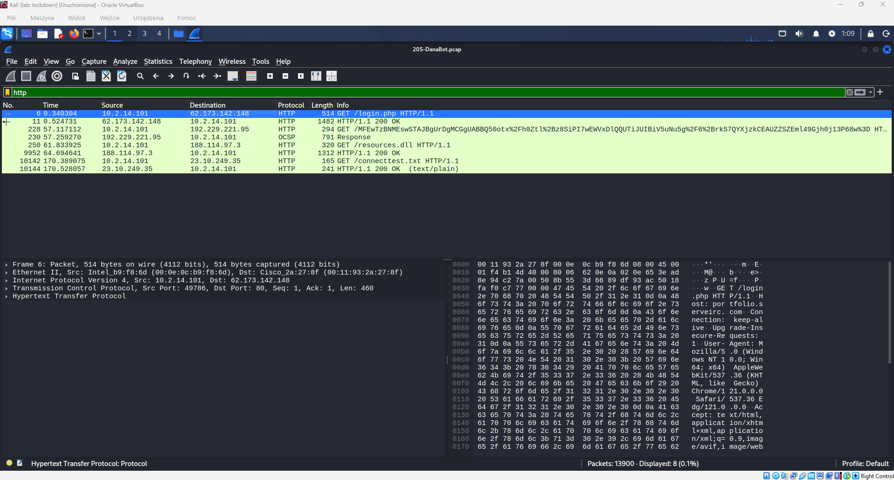
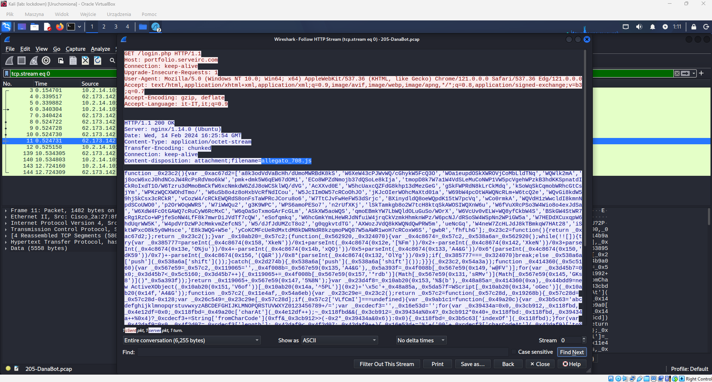
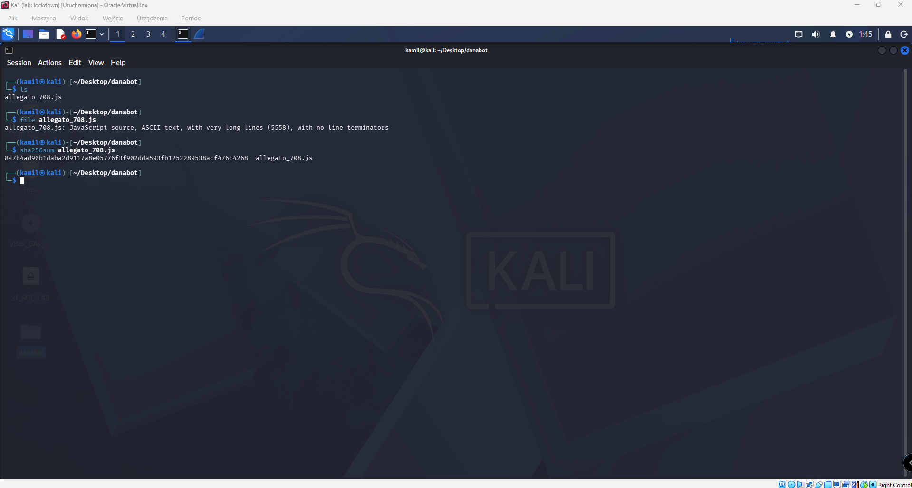
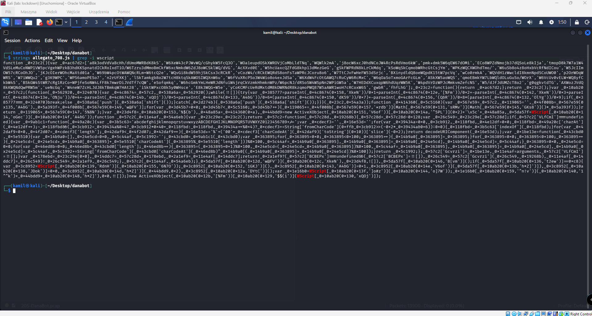
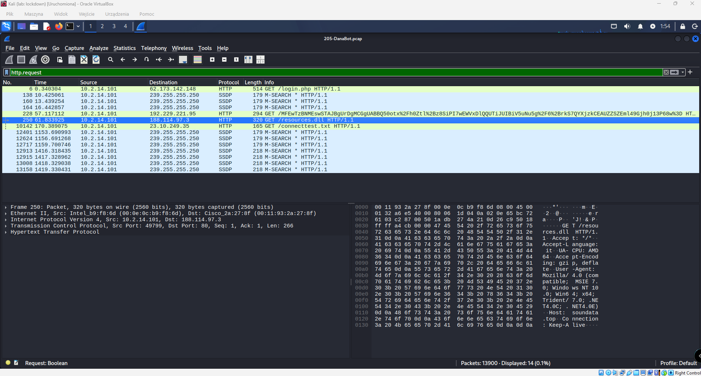
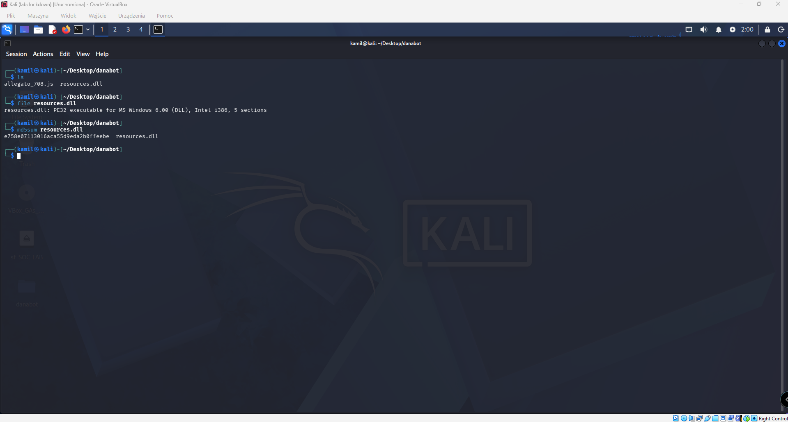

# DanaBot Malware Traffic Analysis

## Overview

This write-up documents the analysis of a DanaBot malware infection using a PCAP file. The goal of the investigation was to identify the attacker infrastructure, malicious files, execution method, and file-based indicators of compromise.

The analysis was performed in Kali Linux using Wireshark and basic Linux command-line tools.

---

## Lab Objective

The objective of this lab was to answer the following investigation questions:

1. Which IP address was used by the attacker during the initial access?
2. What is the name of the malicious file used for initial access?
3. What is the SHA-256 hash of the malicious file used for initial access?
4. Which process was used to execute the malicious file?
5. What is the file extension of the second malicious file utilized by the attacker?
6. What is the MD5 hash of the second malicious file?

---

## Tools Used

- Wireshark
- Kali Linux terminal
- `file`
- `sha256sum`
- `md5sum`
- `strings`
- `grep`

---

## Investigation

## 1. Initial Access IP Address

The investigation started by opening the provided PCAP file in Wireshark and applying the following display filter:

```text
http
```

This allowed me to focus on HTTP traffic and identify suspicious web requests made by the victim machine.

One of the first HTTP requests showed the victim host communicating with an external IP address:

```text
10.2.14.101 → 62.173.142.148
```

The request was:

```text
GET /login.php HTTP/1.1
```

This request indicated that the victim contacted the attacker-controlled server during the initial access stage.



### Finding

```text
Attacker IP: 62.173.142.148
```

---

## 2. Malicious File Used for Initial Access

To identify the malicious file delivered during initial access, I followed the HTTP stream related to the request:

```text
GET /login.php HTTP/1.1
```

Although the URL path was `/login.php`, the HTTP response contained the following header:

```text
Content-Disposition: attachment; filename=allegato_708.js
```

This showed that the attacker server delivered a JavaScript file named:

```text
allegato_708.js
```

The response body also contained obfuscated JavaScript code, confirming that this was the initial malicious payload.



### Finding

```text
Initial malicious file: allegato_708.js
```

---

## 3. SHA-256 Hash of the Initial Malicious File

The malicious JavaScript file was exported from Wireshark using:

```text
File → Export Objects → HTTP
```

After exporting the file, I analyzed it locally in Kali Linux.

First, I confirmed the file type:

```bash
file allegato_708.js
```

The output showed that the file was a JavaScript source file:

```text
allegato_708.js: JavaScript source, ASCII text
```

Then I calculated the SHA-256 hash:

```bash
sha256sum allegato_708.js
```



### Finding

```text
SHA-256: 847b4ad90b1daba2d9117d8e05776f3f902dda593fb1252289538acf476c4268
```

---

## 4. Process Used to Execute the Malicious File

To determine how the JavaScript payload was executed, I performed basic static analysis on the extracted file.

I used the following command:

```bash
strings allegato_708.js | grep -i wscript
```

The output showed references to:

```text
WScript
```

The script also contained ActiveX-related code, which is commonly used by malicious JavaScript executed through Windows Script Host.

This indicates that the malicious JavaScript file was executed using:

```text
wscript.exe
```



### Finding

```text
Execution process: wscript.exe
```

---

## 5. Second-Stage Malicious File

Next, I returned to Wireshark and reviewed the HTTP requests again using:

```text
http.request
```

A later HTTP request showed the victim downloading another suspicious file:

```text
GET /resources.dll HTTP/1.1
```

The destination IP was:

```text
188.114.97.3
```

The HTTP host shown in the packet data was:

```text
soundata.top
```

This indicated that after the initial JavaScript execution, the malware downloaded a second-stage payload named:

```text
resources.dll
```



### Finding

```text
Second-stage file extension: .dll
```

---

## 6. MD5 Hash of the Second-Stage File

The second-stage file was exported from Wireshark and saved as:

```text
resources.dll
```

I verified the file type using:

```bash
file resources.dll
```

The output confirmed that it was a Windows DLL:

```text
resources.dll: PE32 executable for MS Windows 6.00 (DLL), Intel i386, 5 sections
```

Then I calculated the MD5 hash:

```bash
md5sum resources.dll
```



### Finding

```text
MD5: e758e07113016aca55d9eda2b0ffeebe
```

---

## Final Answers

| Question                                   | Answer                                                             |
| ------------------------------------------ | ------------------------------------------------------------------ |
| Attacker IP used during initial access     | `62.173.142.148`                                                   |
| Malicious file used for initial access     | `allegato_708.js`                                                  |
| SHA-256 hash of the initial malicious file | `847b4ad90b1daba2d9117d8e05776f3f902dda593fb1252289538acf476c4268` |
| Process used to execute the malicious file | `wscript.exe`                                                      |
| Extension of the second malicious file     | `.dll`                                                             |
| MD5 hash of the second malicious file      | `e758e07113016aca55d9eda2b0ffeebe`                                 |

---

## Indicators of Compromise

### Network Indicators

| Type                        | Value                    |
| --------------------------- | ------------------------ |
| Victim IP                   | `10.2.14.101`            |
| Attacker IP                 | `62.173.142.148`         |
| Second-stage destination IP | `188.114.97.3`           |
| Initial access host         | `portfolio.serveirc.com` |
| Second-stage host           | `soundata.top`           |

### File Indicators

| File              | Type                | Hash                                                                        |
| ----------------- | ------------------- | --------------------------------------------------------------------------- |
| `allegato_708.js` | JavaScript payload  | SHA-256: `847b4ad90b1daba2d9117d8e05776f3f902dda593fb1252289538acf476c4268` |
| `resources.dll`   | Windows DLL payload | MD5: `e758e07113016aca55d9eda2b0ffeebe`                                     |

### Execution Indicator

| Indicator                | Value         |
| ------------------------ | ------------- |
| Script execution process | `wscript.exe` |

---

## Attack Chain Summary

1. The victim host `10.2.14.101` made an HTTP request to `62.173.142.148`.
2. The attacker-controlled server responded to `GET /login.php`.
3. The HTTP response delivered a JavaScript file named `allegato_708.js`.
4. The JavaScript payload was extracted from the PCAP and hashed.
5. Static analysis of the script showed references to `WScript`, indicating execution via `wscript.exe`.
6. The victim later requested `resources.dll` from `soundata.top`.
7. The second-stage DLL was exported and hashed.
8. The investigation produced network, file, and execution indicators of compromise.

---

## Conclusion

This investigation reconstructed the DanaBot infection chain from the provided PCAP file. HTTP analysis revealed the initial attacker infrastructure, the first-stage JavaScript payload, and the second-stage DLL download.

The extracted files were analyzed locally to identify their file types and generate hashes. The final results provide useful indicators of compromise for detection, threat hunting, and incident response activities.
