# Vulnerability Assessment & Exploitation Lab – Metasploitable2

## Overview

This project demonstrates a complete vulnerability assessment and exploitation workflow performed against a deliberately vulnerable Linux target, Metasploitable2, from a Kali Linux attack machine.

The objective was to simulate a realistic penetration testing engagement by identifying exposed services, performing enumeration, researching vulnerabilities, validating findings through exploitation, and documenting the security risks discovered during the assessment.

The assessment followed a structured methodology consisting of:

- Host Discovery
- Port Scanning
- Service Enumeration
- Vulnerability Identification
- Exploitation
- Post-Exploitation
- Risk Validation

The project was conducted in a controlled home lab environment for educational purposes.

---

## Lab Architecture

### Attacker Machine

- Kali Linux
- Nmap
- SMBClient
- Showmount
- FTP Client
- WhatWeb
- Nikto
- SearchSploit
- Metasploit Framework

### Target Machine

- Metasploitable2
- Ubuntu 8.04 Server
- Multiple intentionally vulnerable services

### Network

| System          | IP Address    |
| --------------- | ------------- |
| Kali Linux      | 192.168.56.10 |
| Metasploitable2 | 192.168.56.20 |

---

## Assessment Scope

The assessment focused on identifying exposed services and evaluating whether publicly known vulnerabilities could be leveraged to gain unauthorized access.

Services identified during enumeration included:

- FTP
- SSH
- Telnet
- SMTP
- DNS
- HTTP
- SMB
- NFS
- MySQL
- PostgreSQL
- IRC
- Apache Tomcat
- VNC

---

# Methodology

## Phase 1 – Host Discovery

The first step was to identify active systems within the lab network.

### Evidence

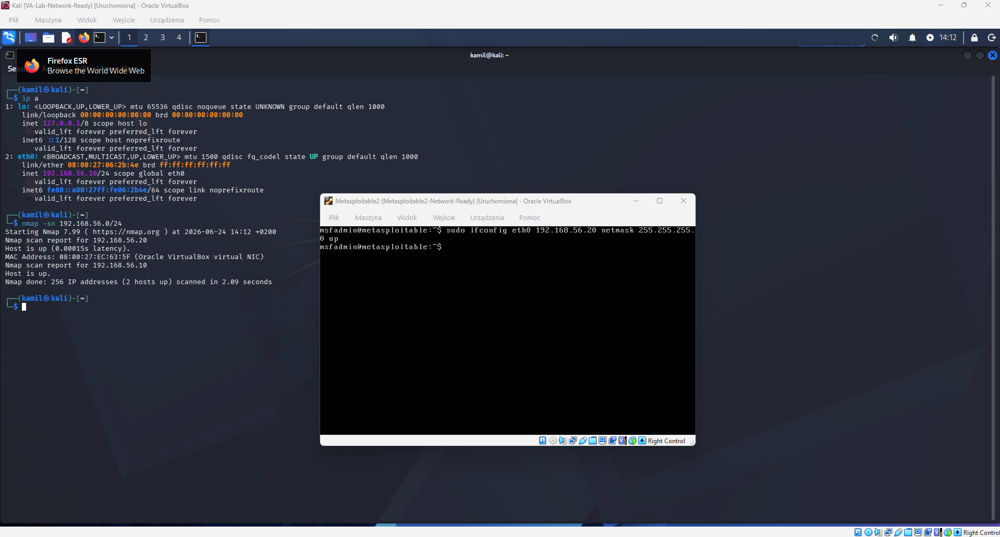

---

## Phase 2 – Port Discovery

A TCP port scan was performed to identify exposed services and attack vectors.

### Evidence

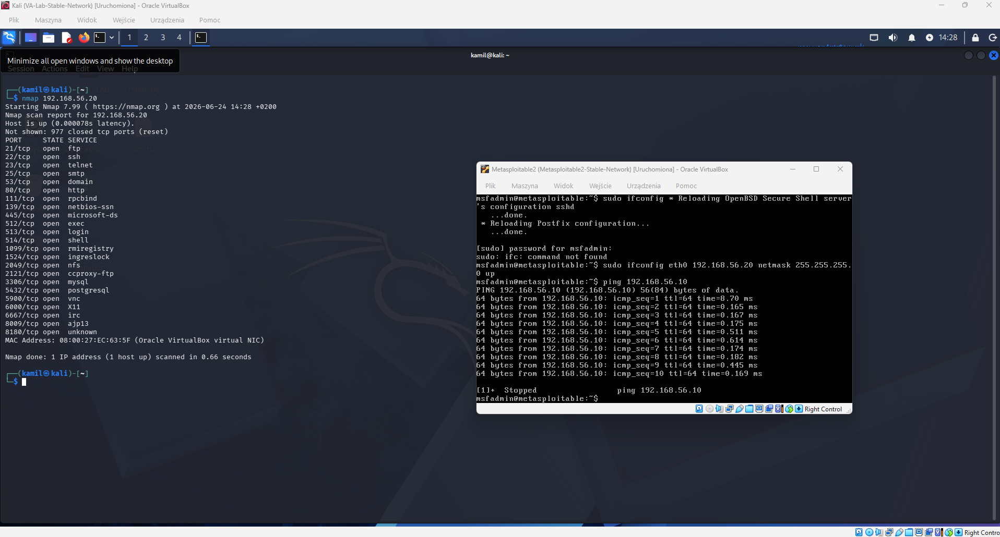

---

## Phase 3 – Service Enumeration

Service version detection was used to identify software versions and gather intelligence about the target environment.

Discovered services included:

- vsFTPd 2.3.4
- Samba 3.0.20
- UnrealIRCd 3.2.8.1
- Apache 2.2.8
- Tomcat 5.5
- MySQL 5.0.51
- PostgreSQL 8.3

### Evidence

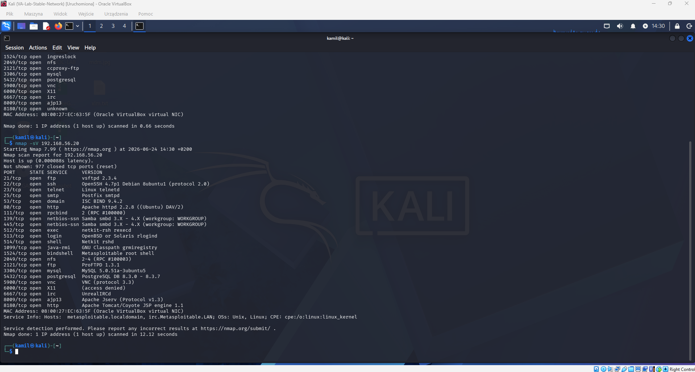

---

## Phase 4 – Full Vulnerability Assessment

Advanced Nmap enumeration was performed using service detection, NSE scripts, and operating system fingerprinting.

The assessment revealed:

- Anonymous FTP access
- SMB information disclosure
- NFS root export
- Outdated web services
- Multiple legacy services
- Weak SMB security configuration

### Evidence

---

## Phase 5 – SMB Enumeration

Anonymous SMB access was successfully established.

Accessible shares included:

- tmp
- opt
- print$

The tmp share exposed files without authentication.

### Evidence

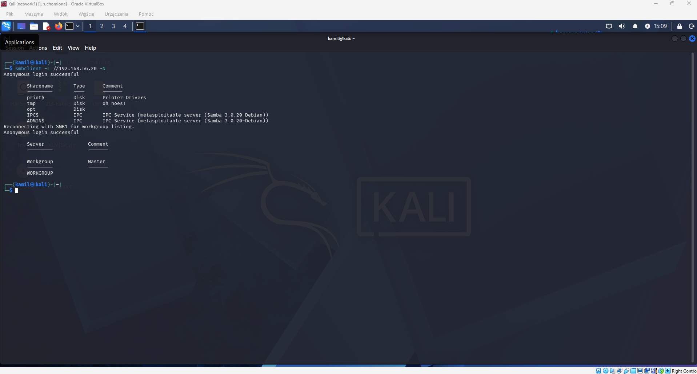

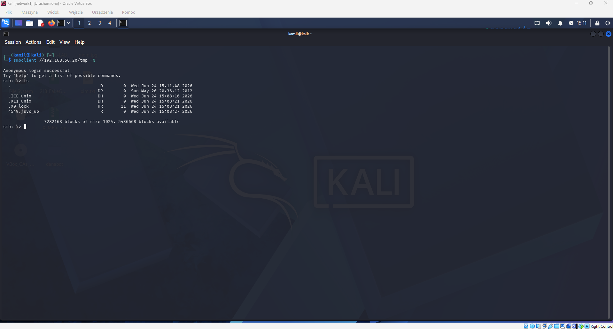

---

## Phase 6 – NFS Enumeration

The NFS service exported the entire root filesystem.

The exported filesystem was mounted directly on the attack machine, allowing access to sensitive directories including:

- /etc
- /home
- /root
- /var

This represents a critical security exposure.

### Evidence

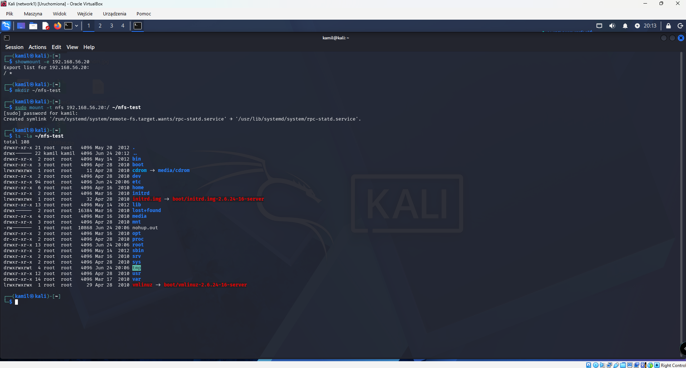

---

## Phase 7 – FTP Enumeration

Anonymous FTP login was enabled.

An attacker could access the FTP service without valid credentials.

### Evidence

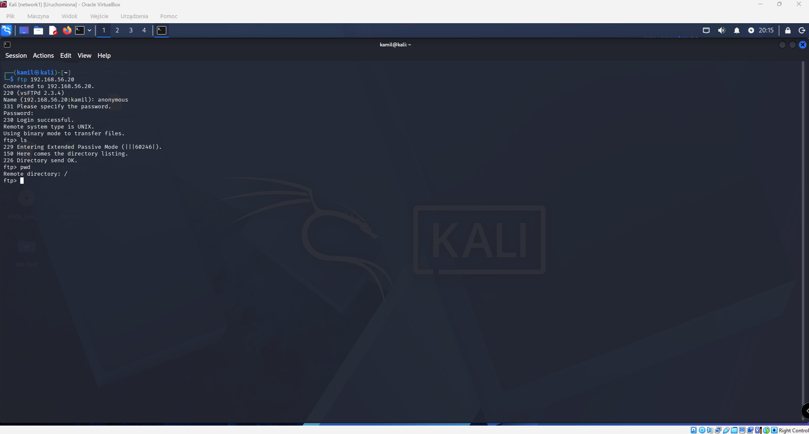

---

## Phase 8 – Web Application Assessment

Web fingerprinting and vulnerability scanning identified:

- Apache 2.2.8
- PHP 5.2.4
- Directory indexing enabled
- HTTP TRACE enabled
- phpinfo exposure
- Outdated software versions
- Weak security headers

### Evidence

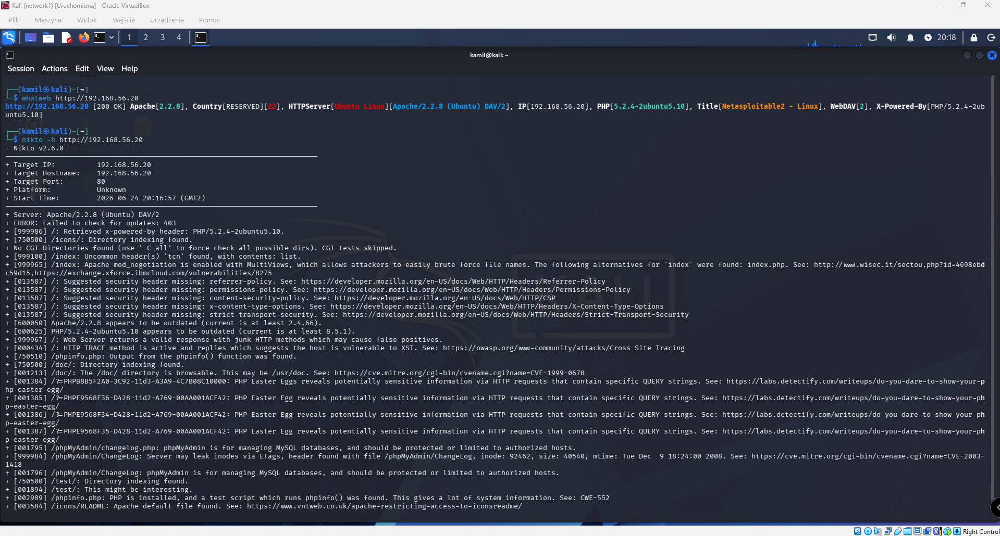

---

## Phase 9 – Vulnerability Identification

Public vulnerability research was performed using SearchSploit.

Several known vulnerabilities were identified, including:

### VSFTPD 2.3.4 Backdoor

- CVE-2011-2523

### Samba Username Map Script

- Remote Command Execution

### UnrealIRCd Backdoor

- Remote Command Execution

### Evidence

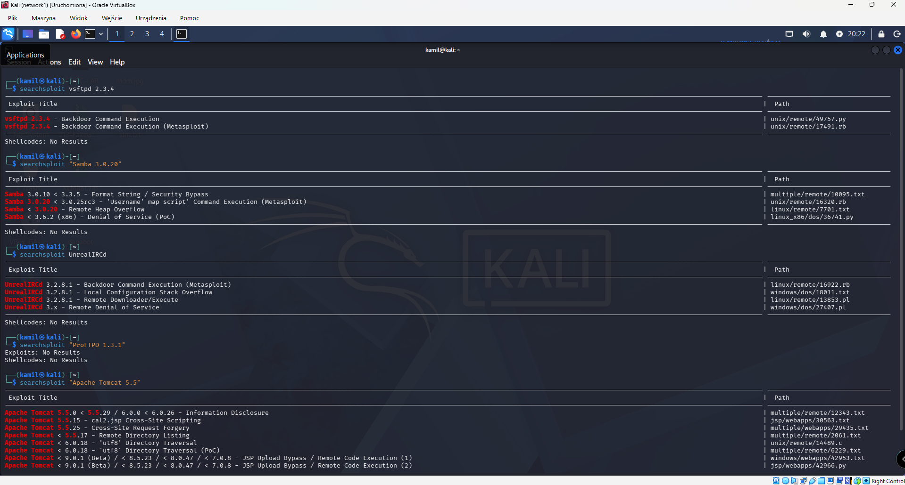

---

# Exploitation

## UnrealIRCd Remote Code Execution

The UnrealIRCd backdoor was successfully exploited using Metasploit.

The exploit resulted in a Meterpreter session with root-level access.

### Evidence

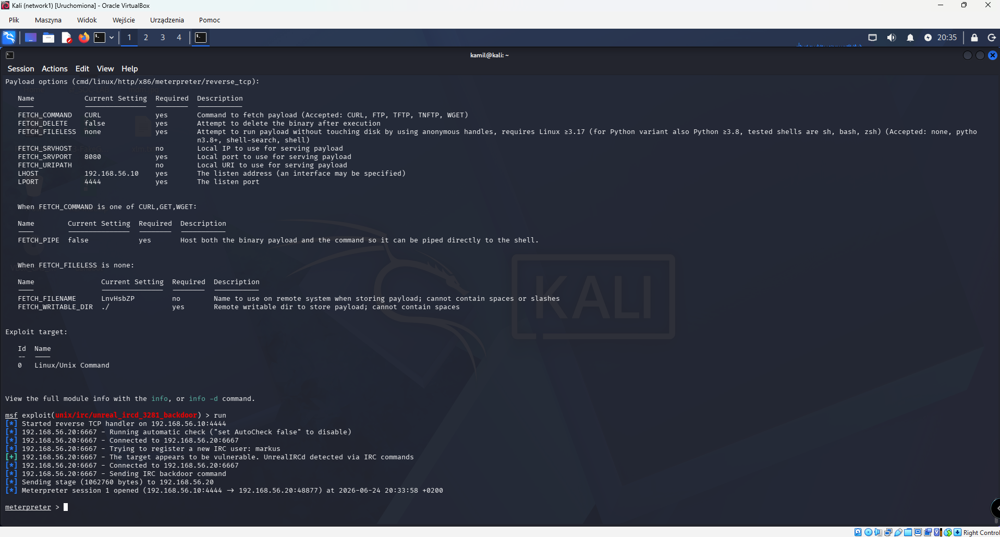

---

# Post-Exploitation

After gaining access, system enumeration was performed.

Information collected included:

- Operating system details
- User accounts
- Running services
- Open network ports
- Privileged binaries

### Evidence

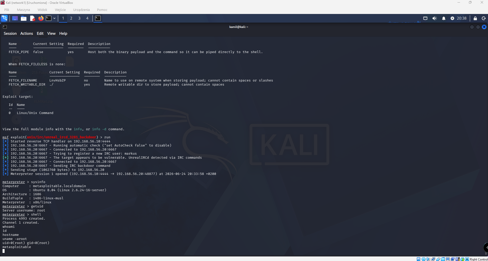

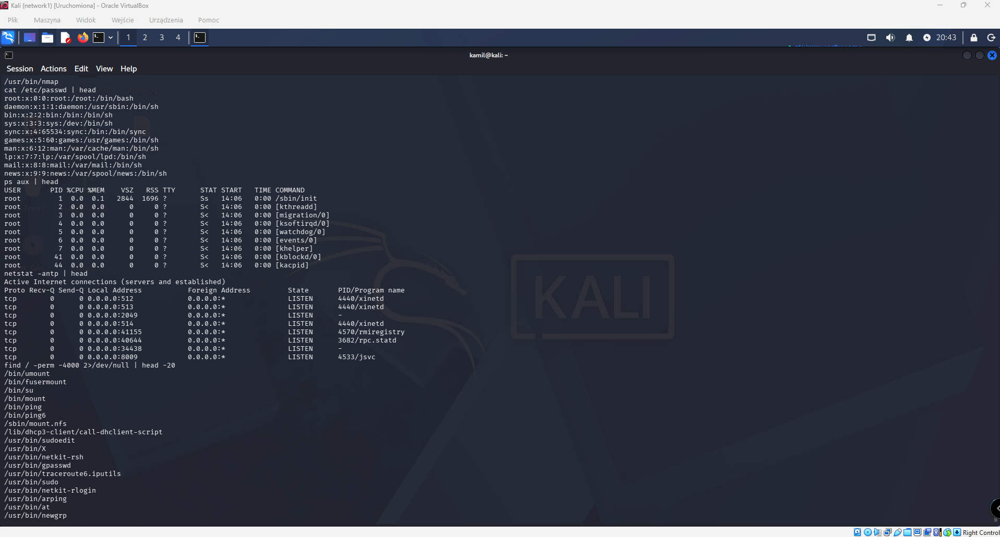

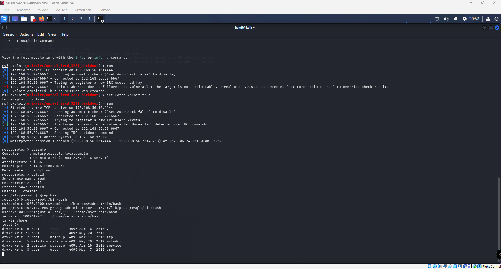

---

# Exploitation Validation

A second exploitation path was validated through the Samba Username Map Script vulnerability.

This demonstrated that multiple critical attack paths existed within the environment.

### Evidence

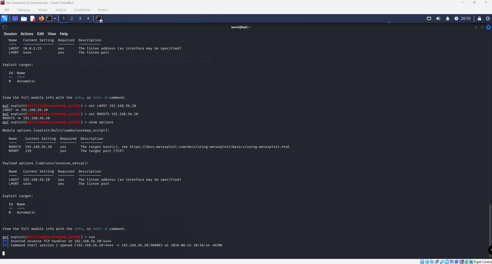

---

# Key Findings

| Finding                       | Severity |
| ----------------------------- | -------- |
| UnrealIRCd Backdoor RCE       | Critical |
| Samba Username Map Script RCE | Critical |
| NFS Root Filesystem Export    | Critical |
| Anonymous FTP Access          | High     |
| Anonymous SMB Access          | High     |
| Outdated Apache Version       | Medium   |
| Outdated PHP Version          | Medium   |
| HTTP TRACE Enabled            | Medium   |
| Directory Listing Enabled     | Medium   |

---

# Skills Demonstrated

- Network Discovery
- Vulnerability Assessment
- Service Enumeration
- SMB Enumeration
- NFS Enumeration
- FTP Enumeration
- Web Application Assessment
- Vulnerability Research
- SearchSploit Usage
- Metasploit Framework
- Exploitation Validation
- Post-Exploitation Enumeration
- Linux Privilege Analysis
- Security Reporting

---

# Tools Used

- Kali Linux
- Nmap
- SMBClient
- Showmount
- FTP
- WhatWeb
- Nikto
- SearchSploit
- Metasploit Framework

---

# Disclaimer

This project was conducted in a controlled laboratory environment using intentionally vulnerable systems. The techniques demonstrated are intended solely for educational purposes, security research, and authorized testing environments.
